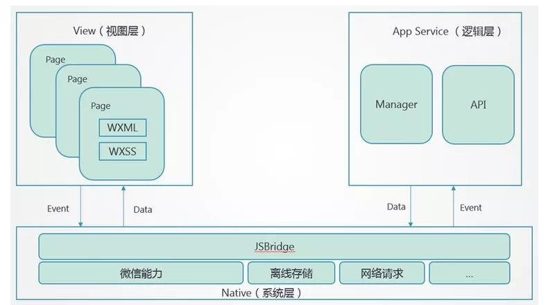
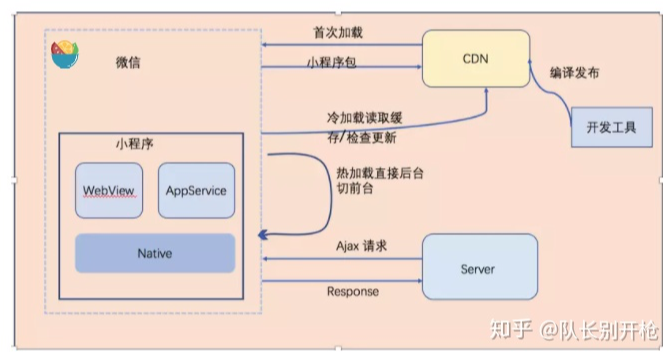
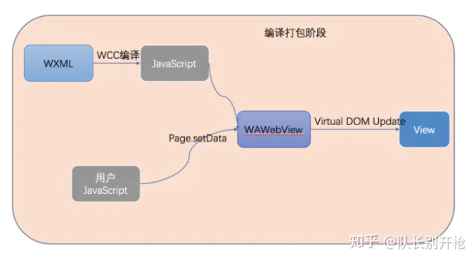

# 微信小程序学习记录

开发小程序知其所以然，让bug不再困难！

### 小程序底层的实现

小程序的渲染是基于双线程的，下面图片就是展示了小程序两个线程之间相互处理的内容。

小程序的底层模型中，视图层和逻辑层分别在不同的线程中处理，所以当我们在修改js的时候需要使用`setData`主动去推送更新，这个过程就是告诉jsBridge要使视图层变更。

### 小程序的技术选型

小程序在设计之初，就是要让程序变得很小，能够在微信生态圈内闭环，而且通过云端访问的速度一点要快。

1. 用一个纯客户端原生技术进行渲染，这里面临的问题是必须得和微信客户端进行集合，跟随着微信发布版本上线
2. 使用纯web技术进行渲染，面临的问题是在纯web中，UI渲染和js是在同一个线程中，我们都知道浏览器的渲染属于单线程，当UI渲染过程有js脚本执行则会停止渲染，等到js执行完毕之后才会继续往下渲染，这个带来的问题是如果js逻辑复杂的情况会造成渲染堵塞，使得长时间的白屏。
3. 使用web技术作为UI渲染，微信原生作为逻辑载体，就是常说的hybrid技术。视图层主要是由web技术进行渲染，同时提供丰富的原生接口进行调用。让开发者使用市场主流的js语言进行编写代码，最终webviwe进行渲染，同时每一个程序都属于单独的webview，丰富了程序的体验，让用户可以同时开启多个webview，微信原生的jssdk提供底层接口的支持，实现更好的性能。
4. 小程序不希望开发者进行DOM相关的操作，包括DOM，iframe，BOM等等，js本身是非常灵活的，这大大的限制了开发者的自由。但是好处是确保了程序的安全可控，出在闭环中。

### js逻辑的执行

js的执行是单独放在一个沙箱环境中的，类似于html5的web worker，在这个沙箱环境中，单独开启了一个线程用来执行javascript。在ios中使用内置的`JSCord`框架，在android中使用腾讯X5内核提供的JSCore环境。

### 双线程的优劣势

1. 小程序是基于双线程模型，那就意味着任何数据传递都是线层间的通信，也就是统一都会有一定的延迟，不像传统web，当界面需要更新时，通过调用更新接口UI就会同步地渲染出来。在小程序的架构里，一切都是异步。
2. 除了逻辑层与渲染层之间的通信有延时，各层与客户端原生交互同样是有延时的。
3. 异步带来的好处，页面也js并行执行，不会出现传统web端js阻塞页面渲染的情况。

### 双线程的生命周期

**小程序需要注意的地方：**

* 小程序的所有页面都是webView渲染，但是TabBar和原生组件（这里的原生组件指的是native端上的原生组件）需要特别注意。

* TabBar：小程序底部导航栏，实际生命周期和APP service保持一致。而不是随着webview容器一起创建销毁。

* 原生组件：小程序中使用的native端上的原生组件。层级与webview同级，但是在webview中通过组件占位，webview中的占位组件位置变化来通知原生组件进行重新绘制。在原生组件内部，其节点树非常简单，基本上可以认为只有一个div元素。上面这行代码在渲染层开始运行时，会经历以下几个步聚：

1. * 组件被创建，包括组件属性会依次赋值

2. * 组件被插入到DOM树里，浏览器内核会立即计算布局，此时我们可以读取出组件相对页面的位置（x, y坐标）、宽高。

3. * 组件通知客户端，客户端在相同的位置上，根据宽高插入一块原生区域，之后客户端就在这块区域渲染界面

4. * 当位置或宽高发生变化时，组件会通知客户端做相应的调整

* 原生组件带来的限制：

1. * 原生组件脱离在WebView渲染流程外，这带来了一些限制。最主要的限制是一些CSS样式无法应用于原生组件，例如，不能在父级节点使用overflow:hidden来裁剪原生组件的显示区域；不能使用transformrotate让原生组件产生旋转等。

2. * 开发者最为常见的问题是，原生组件会浮于页面其他组件之上（相当于拥有正无穷大的z-index值）使其它组件不能覆盖在原生组件上展示。想要解决这个问题，可以考虑使用cover-view和cover-image组件。这两个组件也是原生组件，同样是脱离WebView的渲染流程外，而原生组件之间的层级就可以按照一定的规则控制。

* 原生组件带来的好处：

1. * 扩展Web的能力。比如像输入框组件（input, textarea）有更好地控制键盘的能力。

2. * 体验更好，同时也减轻WebView的渲染工作。比如像地图组件（map）这类较复杂的组件，其渲染工作不占用WebView线程，而交给更高效的客户端原生处理。

3. * 绕过setData、数据通信和重渲染流程，使渲染性能更好。比如像画布组件（canvas）可直接用一套丰富的绘图接口进行绘制。

### 小程序更新机制

小程序启动有两种情况，一种是**冷启动**，一种是**热启动**

- 热启动：假如用户已经打开过某小程序，然后在一定时间内再次打开该小程序，此时无需重新启动，只需将后台态的小程序切换到前台，这个过程就是热启动；
- 冷启动：用户首次打开或小程序被微信主动销毁后再次打开的情况，此时小程序需要重新加载启动，即冷启动。

这里要注意：小程序没有重启的概念。

#### 未启动时更新

开发者在管理后台发布新版本的小程序之后，如果某个用户本地有小程序的历史版本，此时打开的可能还是旧版本。微信客户端会有若干个时机去检查本地缓存的小程序有没有更新版本，如果有则会静默更新到新版本。总的来说，开发者在后台发布新版本之后，无法立刻影响到所有现网用户，但最差情况下，也在发布之后 24 小时之内下发新版本信息到用户。用户下次打开时会先更新最新版本再打开。

#### 启动时更新

小程序每次冷启动时，都会检查是否有更新版本，如果发现有新版本，将会异步下载新版本的代码包，并同时用客户端本地的包进行启动，即新版本的小程序需要等下一次冷启动才会应用上。
如果需要马上应用最新版本，可以使用 wx.getUpdateManager API 进行处理。

### **运行机制**

- 小程序没有重启的概念
- 当小程序进入后台，客户端会维持一段时间的运行状态，超过一定时间后（目前是5分钟）会被微信主动销毁
- 当短时间内（5s）连续收到两次以上收到系统内存告警，会进行小程序的销毁

**视图层运行机制**

### 整体架构

基础库提供组件和 API，处理数据绑定、组件系统、事件系统、通信系统等一系列框架逻辑，可以被注入到渲染层和逻辑层运行。在渲染层可以用各类组件组建界面的元素，在逻辑层可以用各类 API 来处理各种逻辑。